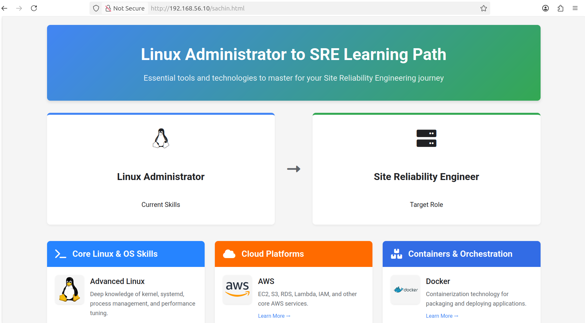

# 🧪 Ansible Labs Project

Welcome to the **Ansible Labs** repository! This project helps you learn and test Ansible automation using local Vagrant-based virtual machines.

---

## 📁 Project Structure

```
ansible-labs/
├── docs/                          # Documentation & screenshots
│   ├── ansible_commands.md        # Cheatsheet of useful Ansible commands
│   ├── vagrant_setup.md           # Guide to set up Vagrant lab
│   └── images/                    # Images used in documentation
│       ├── authorized_keys.png
│       ├── sshd_config.png
│       ├── ssh-restart.png
│       ├── ssh-root-login.png
│       ├── sudo-su-root.png
│       ├── vagrant-ssh-host0.png
│       ├── vagrant-up-output.png
│       └── nginx-playbook-output.png
│
├── inventory/                     # Inventory file for Ansible
│   └── hosts.ini
│
├── playbooks/                     # Ansible playbooks
│   └── nginx.yml                  # Example playbook to configure Nginx
│
├── roles/                         # Reusable Ansible roles
│   └── apache/                    # Apache role
│       ├── tasks/                 # Task definitions
│       │   └── main.yml
│       ├── templates/             # Jinja2 templates (currently empty)
│       └── vars/                  # Variables for the role
│           └── main.yml
│
├── vagrant/                       # Vagrant configuration files
│   └── Vagrantfile
│
├── README.md                      # Project overview
```

---

## 🚀 Getting Started

### 📦 Requirements

- [x] **Linux OS** (tested on Ubuntu/Debian)
- [x] `vagrant`
- [x] `virtualbox`
- [x] `ansible`

---

### ⚙️ Install Vagrant & VirtualBox

```bash
sudo apt update
sudo apt install vagrant
```

> Download and install VirtualBox from:  
> 🔗 https://www.virtualbox.org/wiki/Downloads

### OR

```bash
sudo apt install virtualbox
```

### ⚙️ Install Ansible

```bash
sudo apt install ansible
```

### ✔️ Check Version

```bash
ansible --version
```

---

### 🔐 BIOS Setup (Important)

✅ **Enable**: Virtualization (VT-x / AMD-V)  
🚫 **Disable**: Secure Boot (if VM fails to boot)

---

## 🖥️ Launch Vagrant Hosts

```bash
cd ansible-labs/
sudo vagrant up
```

This will spin up `host0`, `host1`, and `host2` as defined in the `Vagrantfile`.

---

## 📚 Documentation

- 📘 [Vagrant Setup Guide](docs/vagrant_setup.md)  
  Covers BIOS settings, SSH root login, key management, etc.

---

## 📸 Screenshot Previews

You’ll find helpful screenshots in the `docs/images/` folder.

> Example:  
> 

---

## 🔧 Useful Vagrant Commands

| Command                    | Description                          |
|---------------------------|--------------------------------------|
| `vagrant up`              | Start all VMs                        |
| `vagrant ssh host0`       | SSH into a specific VM               |
| `vagrant halt`            | Shut down VMs                        |
| `vagrant destroy`         | Remove all VMs                       |
| `vagrant status`          | Show VM status                       |
| `vagrant reload`          | Restart and reload config            |

---

## 📌 Notes

- Always login as `vagrant` and `sudo su` to root.
- Don’t replace Vagrant's SSH keys unless necessary.
- Configure root login only from inside the VM.

---
## 📚 Ansible Basic commands Cheatsheet
## 📘 [Ansible Commands Cheatsheet](docs/ansible_commands.md)

Open this file to explore more useful commands:  
📄 Quick reference for ad-hoc commands and playbook runs

---

## ▶️ Running Ansible Playbooks

### 🔁 Check VM connectivity

```bash
ansible all -i inventory/hosts.ini -m ping
```

### 🛠️ Run a playbook

```bash
ansible-playbook -i inventory/hosts.ini playbooks/nginx.yml
```

---

## 🌐 Nginx Setup Using Ansible

The `nginx.yml` playbook in `playbooks/` is designed to:

- Install **Nginx** on `host2`  
- Start and enable the Nginx service  
- Create a custom directory `/var/www/html/sachin`  
- Upload a custom `sachin.html` page to that directory  
- Copy and modify the default Nginx config to host the custom page  
- Enable the new config and restart Nginx  

📝 **Important Note:**  
Before running the playbook, you must create a simple HTML file (`sachin.html`) anywhere on your local system.  
Then, update this task in the playbook with the correct file path:

```yaml
- name: copying custom html file from local to host2 
  copy:
    src: /path/to/your/sachin.html    # <-- change this to your actual file location
    dest: /var/www/html/sachin/sachin.html
    owner: www-data
    group: www-data
    mode: 0644
```

This demonstrates how to automate end-to-end web server setup using Ansible.

---

📸 **Playbook Output Screenshot**  
> 

📸 **Final Website Screenshot**  
> 

---

## 🧠 Author

Built by 🚀 *Sachin-Viru!*  
Feel free to fork and extend this lab for your own Ansible experiments.

---

## 📜 License

MIT License – Use freely, learn aggressively.

