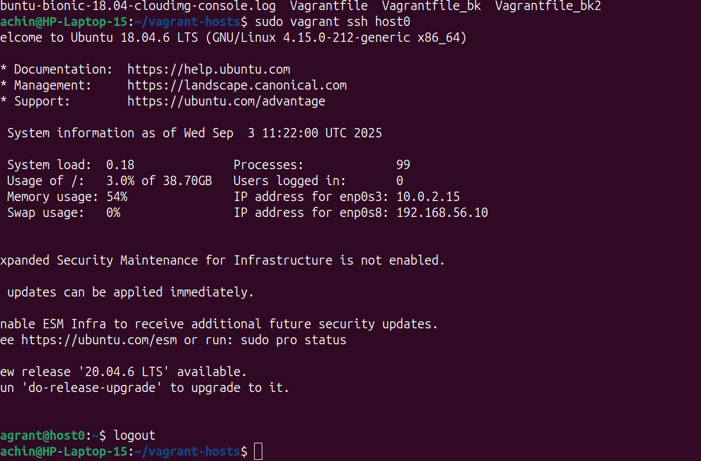
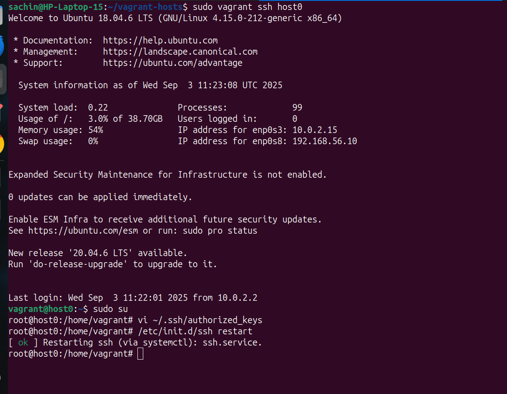
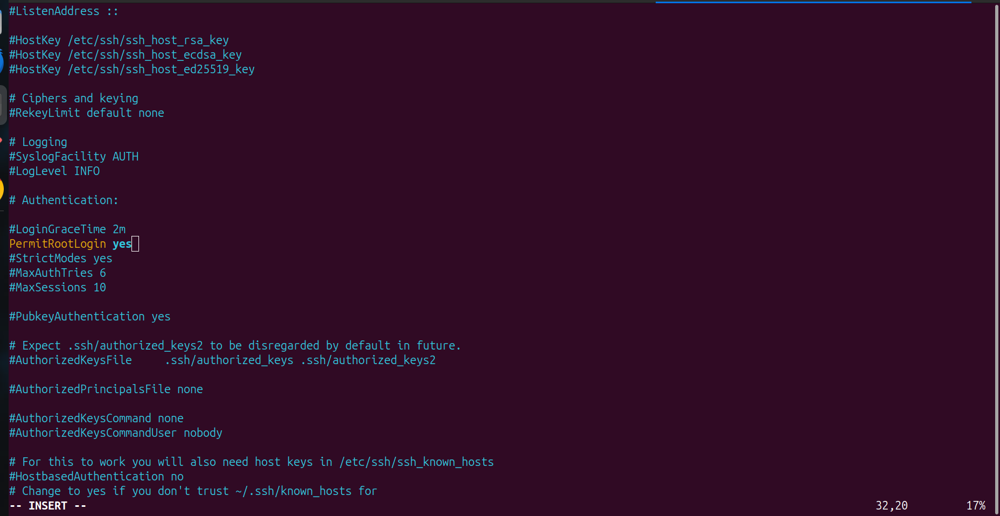
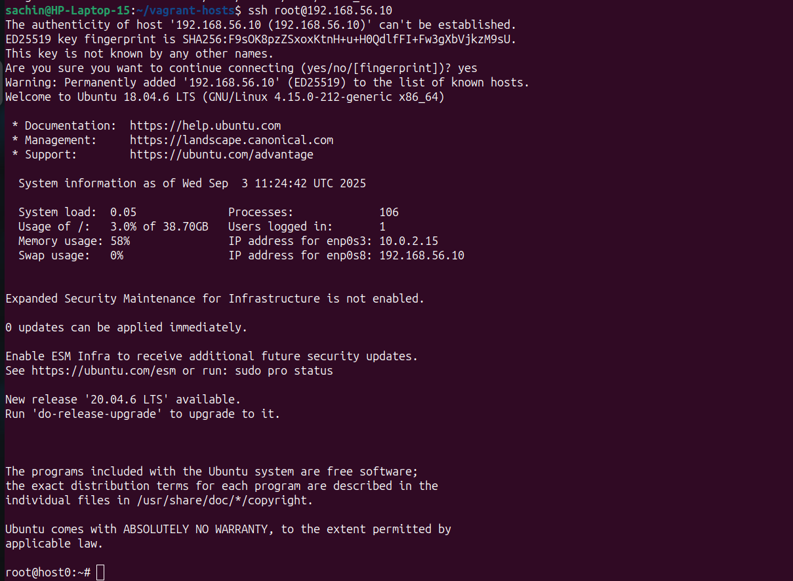

# ⚙️ Vagrant Setup Guide

This document explains how to set up Vagrant hosts with VirtualBox, configure root access via SSH, and prepare your machines for Ansible automation.

---

## 📥 Installation

### 1. Install Vagrant:
```bash
sudo apt update
sudo apt install vagrant
```

### 2. Download and Install VirtualBox
> 📦 Download from: https://www.virtualbox.org/wiki/Downloads

VirtualBox is required as the provider to run Vagrant boxes.

---

## 🔐 BIOS Configuration

> 🛠️ **IMPORTANT:**  
To allow VirtualBox and Vagrant to start VMs properly, make sure to check your BIOS settings:
- **Enable Virtualization (VT-x / AMD-V)**
- **Disable Secure Boot** if you face issues with `vagrant up`

---

## 🏗️ Vagrantfile (Multi-host Setup)

Create a file named `Vagrantfile` in your project directory with the following content:

```ruby
# -*- mode: ruby -*-
# vi: set ft=ruby :

hosts = {
  "host0" => "192.168.56.10",
  "host1" => "192.168.56.11",
  "host2" => "192.168.56.12"
}

Vagrant.configure("2") do |config|
  hosts.each do |name, ip|
    config.vm.define name do |machine|
      machine.vm.box = "ubuntu/bionic64"
      machine.vm.hostname = name
      machine.vm.network :private_network, ip: ip
      machine.vm.provider "virtualbox" do |v|
        v.name = name
        v.memory = 256
      end
    end
  end
end
```

---

## 🚀 Launching the Vagrant Hosts

Run the following to boot all the hosts:

```bash
sudo vagrant up
```

📸 *Screenshot Example:*


---

## 🔐 Accessing Vagrant Machines

### SSH into a specific host:
```bash
sudo vagrant ssh host0
```

📸 *Screenshot Example:*



---

### Switch to root user (no password needed):
```bash
sudo su
```

📸 *Screenshot Example:*



---

### Enable SSH root login and set up keys

#### 1. Add your laptop’s public key to the VM:

```bash
vi ~/.ssh/authorized_keys
```

Paste your **laptop’s public SSH key** here.

📸 *Screenshot Example:*


---

#### 2. Restart SSH service:

```bash
/etc/init.d/ssh restart
```

📸 *Screenshot Example:*


---

#### 3. Enable root login in SSH config:

```bash
vi /etc/ssh/sshd_config
```

Ensure this line is set:

```
PermitRootLogin yes
```

📸 *Screenshot Example:*



---

## ⚠️ Important Notes on Root Access

- Do **not** replace the Vagrant user’s SSH key with your laptop key in `/home/vagrant/.ssh/authorized_keys`.  
  If your VM gets restarted or destroyed and recreated, `vagrant up` will fail due to key mismatch.

- Instead, always log in as **`vagrant`** and **switch to root**, or use `ssh root@<ip>` **after** you’ve manually set up root access.

---

## 🔁 Sample SSH into Root User

Once configured correctly, you can log in directly as root:

```bash
ssh root@192.168.56.10
```

📸 *Screenshot Example:*



---

## 💡 Helpful Vagrant Commands

| Command                      | Description                          |
|-----------------------------|--------------------------------------|
| `vagrant up`                | Start all defined VMs                |
| `vagrant ssh <host>`        | SSH into specific VM (e.g., host0)   |
| `vagrant halt`              | Shut down all VMs                    |
| `vagrant destroy`           | Destroy all VMs                      |
| `vagrant status`            | Show the status of all VMs          |
| `vagrant reload`            | Restart VMs and apply config changes|
| `vagrant suspend`           | Pause VMs without shutting down     |

---

## ✅ Summary

You now have:
- A multi-host Vagrant setup
- SSH access for both `vagrant` and `root`
- Proper key-based login
- Machines ready for Ansible provisioning

> 🧠 Remember to only modify `/root/.ssh/authorized_keys`, not `/home/vagrant/.ssh/authorized_keys` unless you know what you're doing.

---
